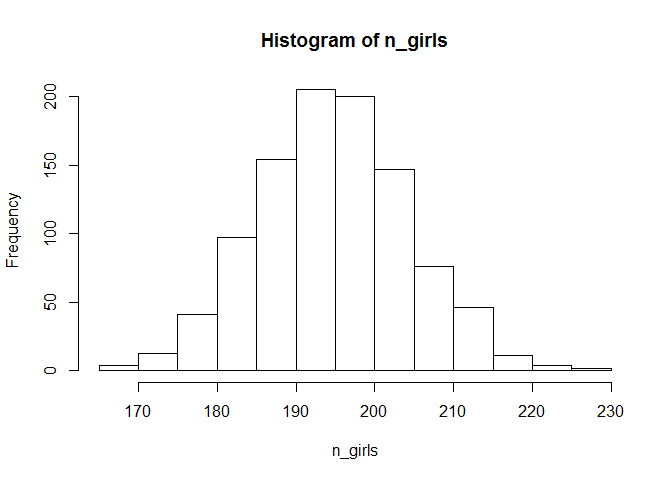
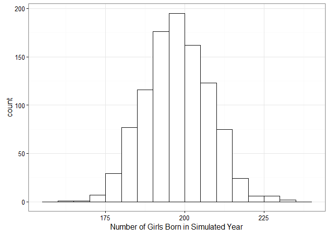
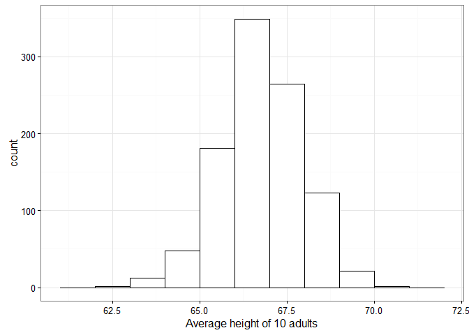
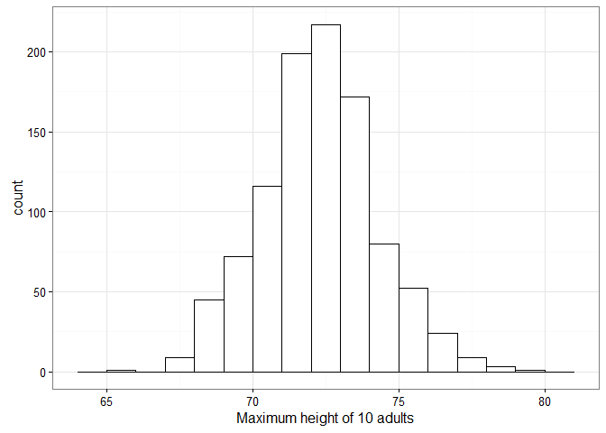

07-01 Simulating Probability Models
===================================

``` r
library("ggplot2")
```

Discrete predictive simulations
-------------------------------

Suppose 400 babies are born in a hospital in one year. How many will be girls?

We know that P(Girl) = .488 and P(Boy) = .512.

``` r
# Simulate one year with 400 draws from a binomial distribution
p_girl <- .488
n_births <- 400
n_girls <- rbinom(1, n_births, p_girl)
n_girls
#> [1] 204

# Simulate 1000 years with a loop
n_sims <- 1000
n_girls <- rep(NA, n_sims)
for (s in seq_len(n_sims)) {
  n_girls[s] <- rbinom(1, n_births, p_girl)
}

hist(n_girls)
```



``` r

# Or tell rbinom to do all 1000 at once
n_girls <- rbinom(1000, n_births, p_girl)

p <- ggplot(data.frame(x1 = n_girls)) +
  aes(x = x1) +
  geom_histogram(colour = "black", fill = "white", binwidth = 5) +
  xlab("Number of Girls Born in Simulated Year") +
  theme_bw()
p
```


### Accounting for twins

Some number of births will be fraternal and identical twins. The probability of a girl in twins is slightly different: P(Girl|Twin) = .495.

``` r
p_frat_twin <- 1 / 125
p_identical_twin <- 1 / 300
p_singleton <- 1 - p_frat_twin - p_identical_twin

p_girl_singleton <- .488
p_girl_twin <- .495
```

Instead of the looping idiom, we use a functional idiom. Write a function to simulate one run, then call `replicate` on the function to do several simulations.

``` r
simulate_year <- function(n_births) {
  birth_type <- sample(
    x = c("fraternal twin", "identical twin", "single birth"),
    size = n_births,
    replace = TRUE,
    prob = c(p_frat_twin, p_identical_twin, p_singleton))

  girls <- rep(NA, n_births)
  for (i in seq_len(n_births)) {
    if (birth_type[i] == "single birth") {
      girls[i] <- rbinom(1, 1, p_girl)
    }
    else if (birth_type[i] == "identical twin") {
      # two-for-one draw
      girls[i] <- 2 * rbinom(1, 1, p_girl_twin)
    }
    else if (birth_type[i] == "fraternal twin") {
      # two draws
      girls[i] <- rbinom(1, 2, p_girl_twin)
    }
  }

  sum(girls)
}

# One year
simulate_year(400)
#> [1] 216

# One thousand
n_girls <- replicate(1000, simulate_year(400))
p %+% (data.frame(x1 = n_girls))
```



Continuous predictive simulations
---------------------------------

You encounter 10 randum adults. What's their average height?

We know the probability of one of the adults being a woman, and we know the mean and sd of heights in each sex.

``` r
p_woman <- .52
men_mean <- 69.1
men_sd <- 2.9
women_mean <- 64.5
women_sd <- 2.7
```

Create a function to do a single simulation

``` r
simulate_heights <- function(n, p_w = p_woman, avg_m = men_mean, sd_m = men_sd,
                             avg_w = women_mean, sd_w = women_sd) {
  # For each sex, draw some heights using each sex's mean/sd
  some_men <- rnorm(n, avg_m, sd_m)
  some_women <- rnorm(n, avg_w, sd_w)

  # Draw sexes
  woman <- rbinom(n, 1, p_w)

  # Take a man's or woman's height based on the each sex draw
  heights <- ifelse(woman == 0, some_men, some_women)
  heights
}

simulate_heights(10)
#>  [1] 61.41706 65.21806 64.81664 64.09702 63.28013 73.17361 60.10151
#>  [8] 65.43639 61.84701 64.07735
```

Then use replicate to perform *n* simulations.

### Simulating average heights

``` r
heights <- replicate(1000, mean(simulate_heights(10)))

p1 <- ggplot(data.frame(x1 = heights)) +
  aes(x = x1) +
  geom_histogram(colour = "black", fill = "white", binwidth = 1) +
  xlab("Average height of 10 adults") +
  theme_bw()
p1
```



### Simulating maximum heights

What is the height of the tallest person in that group of 10 random adults? Simulation helps us with these trickier questions.

``` r
heights <- replicate(1000, max(simulate_heights(10)))

p2 <- (p1 %+% data.frame(x1 = heights)) +
  xlab("Maximum height of 10 adults")
p2
```


