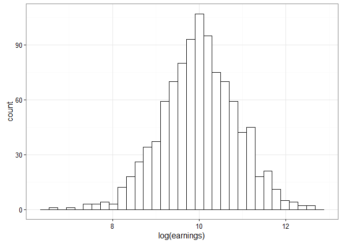
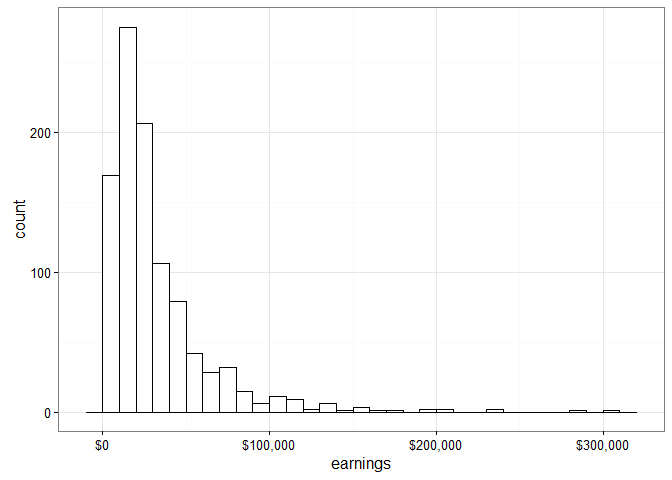

07-02 Summarizing Linear Regression Using Simulation
====================================================

``` r
library("ggplot2")
library("rstan")
rstan_options(auto_write = TRUE)
options(mc.cores = parallel::detectCores())

# Read in the objects from the dump-file and store in list
earnings_env <- new.env()
source("examples/Ch07/earnings.data.R", local = earnings_env)
earnings <- as.list(earnings_env)

# Compute transformed/derived values
earnings$log_earn <- log(earnings$earnings)
earnings$male <- 2 - earnings$sex1
str(earnings)
#> List of 12
#>  $ sex1     : num [1:1192] 1 2 2 2 2 2 2 1 1 1 ...
#>  $ height1  : num [1:1192] 6 5 5 5 5 5 5 6 6 6 ...
#>  $ height2  : num [1:1192] 2 6 4 3 3 4 2 1 0 0 ...
#>  $ earnings : num [1:1192] 50000 60000 30000 50000 51000 9000 29000 32000 2000 27000 ...
#>  $ height   : num [1:1192] 74 66 64 63 63 64 62 73 72 72 ...
#>  $ yearbn   : num [1:1192] 45 32 61 99 51 64 41 44 69 64 ...
#>  $ N        : num 1192
#>  $ hispanic : num [1:1192] 2 2 2 2 2 2 2 2 1 2 ...
#>  $ education: num [1:1192] 16 16 16 16 17 15 12 17 15 12 ...
#>  $ race     : num [1:1192] 1 1 1 3 1 1 1 1 1 1 ...
#>  $ log_earn : num [1:1192] 10.8 11 10.3 10.8 10.8 ...
#>  $ male     : num [1:1192] 1 0 0 0 0 0 0 1 1 1 ...
```

Simulation to represent predictive uncertainty
----------------------------------------------

### Model of log earnings with interactions

``` r
# Fit model
m_earn3 <- lm(log_earn ~ height + male + height:male, earnings)
summary(m_earn3)
#> 
#> Call:
#> lm(formula = log_earn ~ height + male + height:male, data = earnings)
#> 
#> Residuals:
#>     Min      1Q  Median      3Q     Max 
#> -4.2297 -0.3720  0.1388  0.5646  2.2940 
#> 
#> Coefficients:
#>              Estimate Std. Error t value Pr(>|t|)    
#> (Intercept)  8.388488   0.843525   9.945   <2e-16 ***
#> height       0.017008   0.013046   1.304    0.193    
#> male        -0.078586   1.257858  -0.062    0.950    
#> height:male  0.007447   0.018635   0.400    0.690    
#> ---
#> Signif. codes:  0 '***' 0.001 '**' 0.01 '*' 0.05 '.' 0.1 ' ' 1
#> 
#> Residual standard error: 0.8812 on 1188 degrees of freedom
#> Multiple R-squared:  0.08668,    Adjusted R-squared:  0.08438 
#> F-statistic: 37.58 on 3 and 1188 DF,  p-value: < 2.2e-16
```

For direct prediction from an R model, use `predict`. Here we predict the earnings of a 68-inch tall man.

``` r
x_new <- data.frame(height = 68, male = 1)
pred_interval <- predict(m_earn3, x_new, interval = "prediction", level = .95)
pred_interval
#>        fit      lwr      upr
#> 1 9.972807 8.241334 11.70428

# On the original scale
exp(pred_interval)
#>        fit      lwr      upr
#> 1 21435.57 3794.597 121088.9
```

Constructing the predictive interval using simulation
-----------------------------------------------------

Draw from normal distributions where the means are the estimated heights for 68-inch tall men and women and where the standard deviation is the residual standard error in the model.

Note that these draws ignore uncertainty in the estimates of the regression parameters.

``` r
# Set mean and sd
m_68 <- predict(m_earn3, data.frame(male = 1, height = 68))
f_68 <- predict(m_earn3, data.frame(male = 0, height = 68))
sigma_y <- summary(m_earn3)$sigma

# Perform draws
pred_man <- exp(rnorm(1000, m_68, sigma_y))
pred_woman <- exp(rnorm(1000, f_68, sigma_y))
```

Compare the simulated interval to the one given by `predict`:

``` r
quantile(pred_man, probs = c(.025, .975))
#>       2.5%      97.5% 
#>   3968.566 111840.174
```

Now we can make predictive intervals for more complicated statistics, such as the difference on the original dollar scale.

``` r
pred_diff <- pred_man - pred_woman
summary(pred_diff)
#>    Min. 1st Qu.  Median    Mean 3rd Qu.    Max. 
#> -360500   -6965    5635    9436   23560  441000
quantile(pred_diff, probs = c(.025, .975))
#>      2.5%     97.5% 
#> -54822.04  95371.93

pred_ratio <- pred_man / pred_woman
summary(pred_ratio)
#>     Min.  1st Qu.   Median     Mean  3rd Qu.     Max. 
#>  0.03966  0.63680  1.52600  3.19300  3.41400 77.25000
quantile(pred_ratio, probs = c(.025, .975))
#>      2.5%     97.5% 
#>  0.132088 16.014749
```

### Histograms (Figure 07-02)

``` r
log_pred_man <- rnorm(1000, m_68, sigma_y)
frame1 <- data.frame(x1 = log_pred_man)
```

``` r
p1 <- ggplot(frame1) +
  aes(x = x1) +
  geom_histogram(colour = "black", fill = "white") +
  xlab("log(earnings)") +
  theme_bw()
p1
```



``` r

p2 <- ggplot(frame1) +
  aes(x = exp(x1)) +
  geom_histogram(colour = "black", fill = "white", binwidth = 10000) +
  scale_x_continuous(labels = scales::dollar) +
  xlab("earnings") +
  theme_bw()
p2
```



Simulations that account for parameter uncertainty
--------------------------------------------------

Use `arm::sim`. The procedure uses classical regression to get the estimated parameters (beta-hats), a covariance matrix V\_beta, and the residual variance. It then simulates sigmas and betas from those values. See p. 143.

``` r
simulated_parameters <- arm::sim(m_earn3, 1000)
head(coef(simulated_parameters))
#>      (Intercept)      height       male  height:male
#> [1,]    9.413023 0.001461523 -0.4979764  0.013949421
#> [2,]    9.399803 0.001071421 -1.3827970  0.027254456
#> [3,]    7.717447 0.028973540  1.4965951 -0.018286512
#> [4,]    8.589860 0.014392771  0.1996219  0.004553054
#> [5,]    8.038805 0.023148107  0.2961460  0.001382855
#> [6,]    7.572071 0.030464099  1.1038736 -0.010964941

height_beta <- coef(simulated_parameters)[, "height"]
mean(height_beta)
#> [1] 0.01694263
sd(height_beta)
#> [1] 0.01320632
quantile(height_beta, c(.025, .975))
#>         2.5%        97.5% 
#> -0.008365758  0.041932417
```

We can compute estimates of the male slope (the sum of the height parameter and the male:height parameters) using simulation.

``` r
height_for_men <- height_beta + coef(simulated_parameters)[, "height:male"]
quantile(height_for_men, c(.025, .975))
#>         2.5%        97.5% 
#> -0.003029726  0.050457781
```

Stan version of the procedure
-----------------------------

Fit the model in Stan:

``` r
dl_3 <- list(
  N = earnings$N,
  earnings = earnings$earnings,
  height = earnings$height,
  sex = earnings$sex1
)

earnings_interactions_sf1 <- stan(
  file = "examples/Ch07/earnings_interactions.stan",
  data = dl_3,
  iter = 1000,
  chains = 4
)
#> Loading required namespace: rstudioapi
```

Review the model's syntax:

``` r
earnings_interactions_sf1@stanmodel
#> S4 class stanmodel 'earnings_interactions' coded as follows:
#> data {
#>   int<lower=0> N; 
#>   vector[N] earnings;
#>   vector[N] height;
#>   vector[N] sex;
#> } 
#> transformed data {
#>   vector[N] log_earnings;
#>   vector[N] male;
#>   vector[N] height_male_inter;
#> 
#>   log_earnings <- log(earnings);
#>   male <- 2 - sex;
#>   height_male_inter <- height .* male;
#> }
#> parameters {
#>   vector[4] beta;
#>   real<lower=0> sigma;
#> }
#> model {
#>   log_earnings ~ normal(beta[1] + beta[2] * height + beta[3] * male 
#>                              + beta[4] * height_male_inter, sigma);
#> }
```

Inference summary:

``` r
earnings_interactions_sf1
#> Inference for Stan model: earnings_interactions.
#> 4 chains, each with iter=1000; warmup=500; thin=1; 
#> post-warmup draws per chain=500, total post-warmup draws=2000.
#> 
#>            mean se_mean   sd    2.5%     25%     50%     75%   97.5% n_eff
#> beta[1]    8.34    0.04 0.87    6.57    7.79    8.32    8.89   10.10   394
#> beta[2]    0.02    0.00 0.01   -0.01    0.01    0.02    0.03    0.05   394
#> beta[3]   -0.03    0.07 1.30   -2.68   -0.88   -0.02    0.88    2.40   376
#> beta[4]    0.01    0.00 0.02   -0.03   -0.01    0.01    0.02    0.05   370
#> sigma      0.88    0.00 0.02    0.85    0.87    0.88    0.89    0.92   745
#> lp__    -446.00    0.07 1.66 -450.00 -446.90 -445.65 -444.75 -443.79   558
#>         Rhat
#> beta[1] 1.00
#> beta[2] 1.00
#> beta[3] 1.00
#> beta[4] 1.00
#> sigma   1.00
#> lp__    1.01
#> 
#> Samples were drawn using NUTS(diag_e) at Tue Dec 22 11:56:53 2015.
#> For each parameter, n_eff is a crude measure of effective sample size,
#> and Rhat is the potential scale reduction factor on split chains (at 
#> convergence, Rhat=1).
```

Use the posterior samples from the model as the simulated values.

``` r
post <- extract(earnings_interactions_sf1)

height_coef <- post$beta[, 2]
mean(height_coef)
#> [1] 0.017705
sd(height_coef)
#> [1] 0.01346827
quantile(height_coef, c(.025, .975))
#>         2.5%        97.5% 
#> -0.009594101  0.045021112

height_for_men_coef <- post$beta[, 2] + post$beta[, 4]
quantile(height_for_men_coef, c(.025, .975))
#>         2.5%        97.5% 
#> -0.001227704  0.050769641
```
