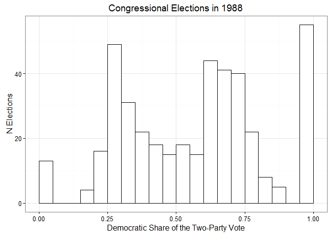
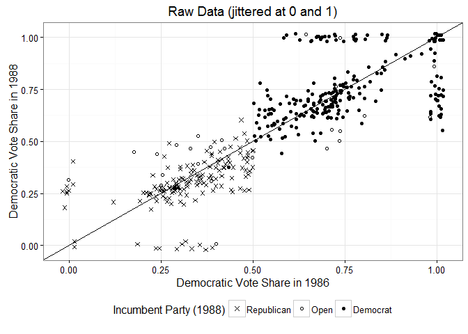
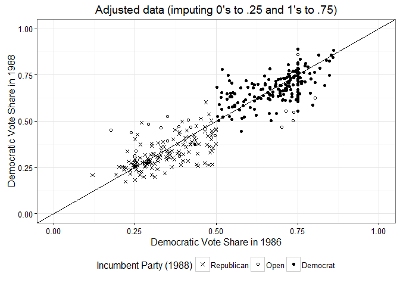
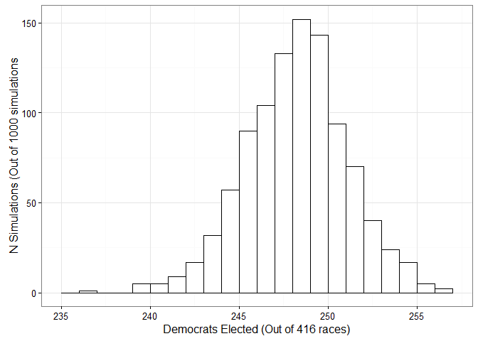
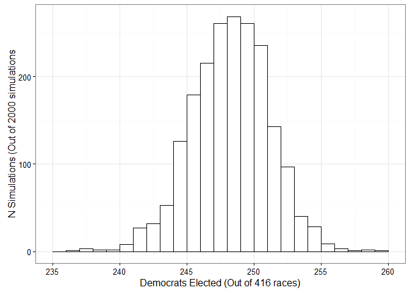

07-03 Simulation for Nonlinear Predictions
==========================================

``` r
library("ggplot2")
library("dplyr")
library("stringr")
library("rstan")
rstan_options(auto_write = TRUE)
options(mc.cores = parallel::detectCores())
```

We're going to fit a model that predicts that Democratic share of the two-party vote in congressional elections. First, we predict 1988 results using the 1986 results and incumbency (i.e., whether a Democrat or Republican were up for reelection or whether the seat was open). Elections with less 10% or more than 90% Democratic votes are "uncontested". Then, using the parameters estimated by this model, we're going to predict the outcomes of the 1990 elections using simulations.

``` r
# These csvs were generated using code in 07-00_CleaningElectionData.R
df_cong <- read.csv("examples/Ch07/congress_long.csv") %>% as.tbl
df_cong
#> Source: local data frame [1,305 x 9]
#> 
#>     year    X1    X2 Incumbent DemVote RepVote  DemShare Contested DemShare_Adj
#>    (int) (int) (int)     (int)   (int)   (int)     (dbl)     (lgl)        (dbl)
#> 1   1986     1     1         1  128930   44122 0.7450362      TRUE    0.7450362
#> 2   1986     1     2         1  109229   52869 0.6738455      TRUE    0.6738455
#> 3   1986     1     3         1  114276   49806 0.6964566      TRUE    0.6964566
#> 4   1986     1     4        -1   66999   77212 0.4645901      TRUE    0.4645901
#> 5   1986     1     5         1   63371   98664 0.3910945      TRUE    0.3910945
#> 6   1986     1     6        -1   62133  111304 0.3582454      TRUE    0.3582454
#> 7   1986     2     1         0  121848  100260 0.5485980      TRUE    0.5485980
#> 8   1986     2     2        -1   43614  148770 0.2267028      TRUE    0.2267028
#> 9   1986     3     1        -1   32396  113653 0.2218160      TRUE    0.2218160
#> 10  1986     3     2         1   91033   47022 0.6593966      TRUE    0.6593966
#> ..   ...   ...   ...       ...     ...     ...       ...       ...          ...

# Same data from above but spread out by year, so we can do things like use 1986
# columns to predict 1988 columns.
df_cong_wide <- read.csv("examples/Ch07/congress_wide.csv") %>% as.tbl
str(df_cong_wide)
#> Classes 'tbl_df', 'tbl' and 'data.frame':    435 obs. of  14 variables:
#>  $ X1               : int  1 1 1 1 1 1 2 2 3 3 ...
#>  $ X2               : int  1 2 3 4 5 6 1 2 1 2 ...
#>  $ Contested_1986   : int  1 1 1 1 1 1 1 1 1 1 ...
#>  $ Contested_1988   : int  1 1 1 1 1 1 1 1 1 0 ...
#>  $ Contested_1990   : int  1 1 1 1 1 1 1 1 1 0 ...
#>  $ DemShare_1986    : num  0.745 0.674 0.696 0.465 0.391 ...
#>  $ DemShare_1988    : num  0.772 0.636 0.665 0.274 0.264 ...
#>  $ DemShare_1990    : num  0.714 0.597 0.521 0.234 0.477 ...
#>  $ DemShare_Adj_1986: num  0.745 0.674 0.696 0.465 0.391 ...
#>  $ DemShare_Adj_1988: num  0.772 0.636 0.665 0.274 0.264 ...
#>  $ DemShare_Adj_1990: num  0.714 0.597 0.521 0.234 0.477 ...
#>  $ Incumbent_1986   : int  1 1 1 -1 1 -1 0 -1 -1 1 ...
#>  $ Incumbent_1988   : int  1 1 1 -1 -1 -1 1 -1 -1 1 ...
#>  $ Incumbent_1990   : int  1 1 0 -1 0 -1 0 -1 -1 1 ...
```

Figure 7.3
----------

``` r
v88_hist <- df_cong %>%
  filter(year == 1988) %>%
  # Turn uncontested proportions into landslides, for presentation purposes
  mutate(Landslides = ifelse(DemShare < 0.1, .0001, DemShare),
         Landslides = ifelse(0.9 < DemShare, 0.9999, Landslides))
```

``` r
p1 <- ggplot(v88_hist) +
  aes(x = Landslides) +
  geom_histogram(colour = "black", fill = "white", binwidth = 0.05) +
  scale_x_continuous("Democratic Share of the Two-Party Vote", limits = c(0, 1)) +
  labs(title = "Congressional Elections in 1988", y = "N Elections") +
  theme_bw()
p1
```



> Figure 7.3 *Histogram of congressional election data from 1988. The spikes at the left and right ends represent uncontested Republicans and Democrats, respectively.*

Fitting the model (R)
---------------------

We are modeling just the contested elections from 1988. That is, we are excluded the spikes from the histogram above.

``` r
df_m <- df_cong_wide %>%
  filter(Contested_1988 == 1)
```

In the book, the model is fit with `lm(vote.88 ~ vote.86 + incumbency.88)`.

``` r
m_88 <- lm(DemShare_Adj_1988 ~ DemShare_Adj_1986 + Incumbent_1988, df_m)
summary(m_88)
#> 
#> Call:
#> lm(formula = DemShare_Adj_1988 ~ DemShare_Adj_1986 + Incumbent_1988, 
#>     data = df_m)
#> 
#> Residuals:
#>       Min        1Q    Median        3Q       Max 
#> -0.172803 -0.035641 -0.005528  0.041397  0.219997 
#> 
#> Coefficients:
#>                   Estimate Std. Error t value Pr(>|t|)    
#> (Intercept)       0.201998   0.018200   11.10   <2e-16 ***
#> DemShare_Adj_1986 0.583276   0.035045   16.64   <2e-16 ***
#> Incumbent_1988    0.077052   0.007036   10.95   <2e-16 ***
#> ---
#> Signif. codes:  0 '***' 0.001 '**' 0.01 '*' 0.05 '.' 0.1 ' ' 1
#> 
#> Residual standard error: 0.0673 on 340 degrees of freedom
#>   (5 observations deleted due to missingness)
#> Multiple R-squared:  0.8769, Adjusted R-squared:  0.8762 
#> F-statistic:  1211 on 2 and 340 DF,  p-value: < 2.2e-16
```

### Figure 7.4

These plots show the raw data versus the modeled dataset.

``` r
# Create a dataframe just for plotting with shorter column names.
df_plot <- df_cong_wide
names(df_plot) <- names(df_plot) %>%
  str_replace("Contested", "Con") %>%
  str_replace("DemShare_", "Dem_") %>%
  str_replace("Incumbent", "Inc")

set_incumbent_factor <- function(xs) {
  incumbent_levels <- c(Republican = -1, Open = 0, Democrat = 1)
  factor(xs, incumbent_levels, names(incumbent_levels))
}

# Jitter uncontested points and create labels for incumbent status
df_plot <- df_plot %>%
  mutate(Jit_86 = ifelse(Con_1986, Dem_1986, jitter(Dem_1986, amount = 0.02)),
         Jit_88 = ifelse(Con_1988, Dem_1988, jitter(Dem_1988, amount = 0.02)),
         Inc_1988 = set_incumbent_factor(Inc_1988))
```

``` r
p2 <- ggplot(df_plot) +
  aes(x = Jit_86, y = Jit_88, shape = Inc_1988) +
  geom_point() +
  geom_abline(intercept = 0, slope = 1) +
  scale_shape_manual(name = "Incumbent Party (1988)", values = c(4, 1, 16)) +
  xlab("Democratic Vote Share in 1986") +
  ylab("Democratic Vote Share in 1988") +
  labs(title = "Raw Data (jittered at 0 and 1)") +
  theme_bw() +
  theme(legend.position = "bottom")
p2
```



> Figure 7.4 (a) *Congressional election data from 1986 and 1988. Crosses correspond to elections with Republican incumbents running in 1988, dots correspond to Democratic incumbents, and open circles correspond to open seats. The “incumbency” predictor in the regression model equals 0 for the circles, +1 for the dots, and −1 for the crosses. Uncontested election outcomes (at 0 and 1) have been jittered slightly.*

The uncontested seats below line are the ones that get imputed to .25 or .75 for the model. We see these points in the next plot as a vertical band of points at .25 and .75.

The uncontested seats above the line are excluded from the model.

``` r
p3 <- ggplot(df_m) +
  aes(x = DemShare_Adj_1986, DemShare_Adj_1988,
      shape = set_incumbent_factor(Incumbent_1988)) +
  geom_point() +
  geom_abline(intercept = 0, slope = 1) +
  scale_shape_manual(name = "Incumbent Party (1988)", values = c(4, 1, 16)) +
  xlim(c(0, 1)) +
  ylim(c(0, 1)) +
  xlab("Democratic Vote Share in 1986") +
  ylab("Democratic Vote Share in 1988") +
  labs(title = "Adjusted data (imputing 0's to .25 and 1's to .75)") +
  theme_bw() +
  theme(legend.position = "bottom")
p3
```



> Figure 7.4 (b) *Data for the regression analysis, with uncontested 1988 elections removed and uncontested 1986 election values replaced by 0.25 and 0.75. The y = x line is included as a comparison on both plots.*

Simulation for inferences and predictions of new data points (R)
----------------------------------------------------------------

First, we create the predictor matrix, x-tilde.

``` r
x_tilde <- df_cong_wide %>%
  mutate(Constant = 1) %>%
  select(Constant, DemShare_1988, Incumbent_1990) %>%
  na.omit %>%
  as.matrix
tail(x_tilde)
#>        Constant DemShare_1988 Incumbent_1990
#> [411,]        1     0.6759946              1
#> [412,]        1     0.7632877              1
#> [413,]        1     0.2913369             -1
#> [414,]        1     0.3734544             -1
#> [415,]        1     0.4409670              0
#> [416,]        1     1.0000000              0
```

Next, write a function to simulate one election. First, we draw parameter estimates and model error. Then we multiply the predictor matrix by the parameter estimates and add the model error.

``` r
predict_88 <- function(pred_matrix, model) {
  n_pred <- nrow(pred_matrix)
  sim_88 <- arm::sim(model, 1)
  # "For each simulation, we compute the predicted value Xtilde*β and add normal
  # errors." [146]
  y_pred <- rnorm(n_pred, pred_matrix %*% t(sim_88@coef), sim_88@sigma)
  y_pred
}
```

Finally, we simulate 1000 elections and count the number of Democrats projected in each election.

``` r
y_tilde <- replicate(1000, predict_88(x_tilde, m_88))
n_democrats_tilde <- colSums(.5 < y_tilde, na.rm = TRUE)

p4 <- ggplot() +
  aes(x = n_democrats_tilde) +
  geom_histogram(binwidth = 1, color = "black", fill = "white") +
  xlab("Democrats Elected (Out of 416 races)") +
  ylab("N Simulations (Out of 1000 simulations") +
  theme_bw()
p4
```



The book notes that the elections have a predictive uncertainty of approximately .7. We can get this estimate by simulating sigma.

``` r
sigmas <- arm::sim(m_88, 1000)@sigma
summary(sigmas)
#>    Min. 1st Qu.  Median    Mean 3rd Qu.    Max. 
#> 0.06074 0.06563 0.06736 0.06739 0.06903 0.07716
```

Our estimates our slightly off from the book, which was median = 253, mean = 252.4 and sd = 3.1. (I'm not sure if this is a bug in my part, a bug in the book, a bug in `arm` that has been resolved, or if my code and the book are working on different subsets of data. It doesn't really matter.)

``` r
summary(n_democrats_tilde)
#>    Min. 1st Qu.  Median    Mean 3rd Qu.    Max. 
#>   236.0   246.0   248.0   247.7   250.0   256.0
sd(n_democrats_tilde)
#> [1] 2.879744
```

But the larger point remains:

> "This estimate and standard error *could not* simply be calculated from the estimates and uncertainties for the individual districts. Simulation is the only practical method of assessing the predictive uncertainty for this nonlinear function of the predicted outcomes." [147]

Fitting the model (Stan)
------------------------

Use the same data as the R version, but first remove NA rows (list-wise deletion).

``` r
df_stan <- df_m %>%
  select(DemShare_Adj_1986, Incumbent_1988, DemShare_1988) %>%
  na.omit
```

And specify the number of observations explicitly.

``` r
data_stan_congress <- list(
  N = nrow(df_stan),
  vote_88 = df_stan$DemShare_1988,
  vote_86 = df_stan$DemShare_Adj_1986,
  incumbency_88 = df_stan$Incumbent_1988)

# Compute 2000 posterior samples (4 chains * 1000 iterations * .5 warmup
# iterations).
stan_congress <- stan(
  file = "examples/Ch07/congress.stan",
  data = data_stan_congress,
  iter = 1000,
  chains = 4)
```

Review the model syntax.

``` r
stan_congress@stanmodel
#> S4 class stanmodel 'congress' coded as follows:
#> data {
#>   int<lower=0> N; 
#>   vector[N] incumbency_88;
#>   vector[N] vote_86;
#>   vector[N] vote_88;
#> }
#> parameters {
#>   vector[3] beta;
#>   real<lower=0> sigma;
#> } 
#> model {
#>     vote_88 ~ normal(beta[1] + beta[2] * vote_86 
#>                      + beta[3] * incumbency_88,sigma);
#> }
```

The parameter estimates are similiar to the R models. We can also see the predictive uncertainty (the stats for `sigma`).

``` r
stan_congress
#> Inference for Stan model: congress.
#> 4 chains, each with iter=1000; warmup=500; thin=1; 
#> post-warmup draws per chain=500, total post-warmup draws=2000.
#> 
#>           mean se_mean   sd   2.5%    25%    50%    75%  97.5% n_eff Rhat
#> beta[1]   0.20    0.00 0.02   0.16   0.19   0.20   0.22   0.24   375 1.00
#> beta[2]   0.58    0.00 0.04   0.51   0.56   0.58   0.61   0.66   381 1.00
#> beta[3]   0.08    0.00 0.01   0.06   0.07   0.08   0.08   0.09   390 1.00
#> sigma     0.07    0.00 0.00   0.06   0.07   0.07   0.07   0.07   518 1.01
#> lp__    750.77    0.07 1.48 747.11 750.02 751.15 751.87 752.63   488 1.01
#> 
#> Samples were drawn using NUTS(diag_e) at Mon Dec 28 12:50:08 2015.
#> For each parameter, n_eff is a crude measure of effective sample size,
#> and Rhat is the potential scale reduction factor on split chains (at 
#> convergence, Rhat=1).
```

Simulation for inferences and predictions of new data points (Stan)
-------------------------------------------------------------------

The 2000 posterior draws are our 2000 simulations, so we just need to estimate the means and add normal noise in each simulation, as we did above.

``` r
fit88_post <- rstan::extract(stan_congress)

# Use the same predictor matrix
tail(x_tilde)
#>        Constant DemShare_1988 Incumbent_1990
#> [411,]        1     0.6759946              1
#> [412,]        1     0.7632877              1
#> [413,]        1     0.2913369             -1
#> [414,]        1     0.3734544             -1
#> [415,]        1     0.4409670              0
#> [416,]        1     1.0000000              0

# Betas: One row per simulation, one column per beta.
tail(fit88_post$beta)
#>           
#> iterations      [,1]      [,2]       [,3]
#>    [1995,] 0.2257016 0.5363818 0.08359562
#>    [1996,] 0.1964926 0.5992954 0.07569998
#>    [1997,] 0.1750727 0.6239232 0.07489674
#>    [1998,] 0.1970533 0.5896858 0.07657892
#>    [1999,] 0.2032916 0.5816903 0.08543444
#>    [2000,] 0.1961273 0.5876908 0.07987644
```

Estimate the means.

``` r
est_means <- x_tilde %*% t(fit88_post$beta)
```

Add normal noise to each column of means.

``` r
y_tilde <-  matrix(numeric(), nrow = nrow(est_means), ncol = ncol(est_means))
for (simulation in seq_len(ncol(y_tilde))) {
  means_i <- est_means[, simulation]
  sigma_i <- fit88_post$sigma[simulation]
  y_tilde[, simulation] <- rnorm(length(means_i), means_i, sigma_i)
}
```

Compute the number of Democrat wins in each simulation.

``` r
n_democrats_tilde <- colSums(.5 < y_tilde)
summary(n_democrats_tilde)
#>    Min. 1st Qu.  Median    Mean 3rd Qu.    Max. 
#>   236.0   246.0   248.0   247.8   250.0   259.0
sd(n_democrats_tilde)
#> [1] 2.907946

p5 <- ggplot() +
  aes(x = n_democrats_tilde) +
  geom_histogram(binwidth = 1, color = "black", fill = "white") +
  xlab("Democrats Elected (Out of 416 races)") +
  ylab("N Simulations (Out of 2000 simulations") +
  theme_bw()
p5
```



------------------------------------------------------------------------

``` r
sesh_info <- devtools::session_info()

sesh_info$platform
#>  setting  value                       
#>  version  R version 3.2.2 (2015-08-14)
#>  system   x86_64, mingw32             
#>  ui       RStudio (0.99.473)          
#>  language (EN)                        
#>  collate  English_United States.1252  
#>  tz       America/Chicago             
#>  date     2015-12-28

sesh_info$packages
#>  package    * version date       source        
#>  abind        1.4-3   2015-03-13 CRAN (R 3.2.2)
#>  arm          1.8-6   2015-07-11 CRAN (R 3.2.2)
#>  assertthat   0.1     2013-12-06 CRAN (R 3.2.2)
#>  coda         0.18-1  2015-10-16 CRAN (R 3.2.2)
#>  codetools    0.2-14  2015-07-15 CRAN (R 3.2.2)
#>  colorspace   1.2-6   2015-03-11 CRAN (R 3.2.2)
#>  DBI          0.3.1   2014-09-24 CRAN (R 3.2.2)
#>  devtools     1.9.1   2015-09-11 CRAN (R 3.2.2)
#>  digest       0.6.8   2014-12-31 CRAN (R 3.2.2)
#>  dplyr      * 0.4.3   2015-09-01 CRAN (R 3.2.2)
#>  evaluate     0.8     2015-09-18 CRAN (R 3.2.2)
#>  formatR      1.2.1   2015-09-18 CRAN (R 3.2.3)
#>  ggplot2    * 2.0.0   2015-12-18 CRAN (R 3.2.3)
#>  gridExtra    2.0.0   2015-07-14 CRAN (R 3.2.2)
#>  gtable       0.1.2   2012-12-05 CRAN (R 3.2.2)
#>  htmltools    0.2.6   2014-09-08 CRAN (R 3.2.2)
#>  inline       0.3.14  2015-04-13 CRAN (R 3.2.3)
#>  knitr      * 1.11    2015-08-14 CRAN (R 3.2.2)
#>  labeling     0.3     2014-08-23 CRAN (R 3.2.2)
#>  lattice      0.20-33 2015-07-14 CRAN (R 3.2.2)
#>  lazyeval     0.1.10  2015-01-02 CRAN (R 3.2.2)
#>  lme4         1.1-10  2015-10-06 CRAN (R 3.2.2)
#>  magrittr     1.5     2014-11-22 CRAN (R 3.2.2)
#>  MASS         7.3-43  2015-07-16 CRAN (R 3.2.2)
#>  Matrix       1.2-2   2015-07-08 CRAN (R 3.2.2)
#>  memoise      0.2.1   2014-04-22 CRAN (R 3.2.2)
#>  minqa        1.2.4   2014-10-09 CRAN (R 3.2.2)
#>  munsell      0.4.2   2013-07-11 CRAN (R 3.2.2)
#>  nlme         3.1-121 2015-06-29 CRAN (R 3.2.2)
#>  nloptr       1.0.4   2014-08-04 CRAN (R 3.2.2)
#>  plyr         1.8.3   2015-06-12 CRAN (R 3.2.2)
#>  R6           2.1.1   2015-08-19 CRAN (R 3.2.2)
#>  Rcpp         0.12.2  2015-11-15 CRAN (R 3.2.2)
#>  rmarkdown    0.9     2015-12-22 CRAN (R 3.2.3)
#>  rstan      * 2.8.2   2015-11-27 CRAN (R 3.2.3)
#>  rstudioapi   0.4.0   2015-12-09 CRAN (R 3.2.3)
#>  scales       0.3.0   2015-08-25 CRAN (R 3.2.2)
#>  stringi      1.0-1   2015-10-22 CRAN (R 3.2.2)
#>  stringr    * 1.0.0   2015-04-30 CRAN (R 3.2.2)
#>  yaml         2.1.13  2014-06-12 CRAN (R 3.2.2)
```
